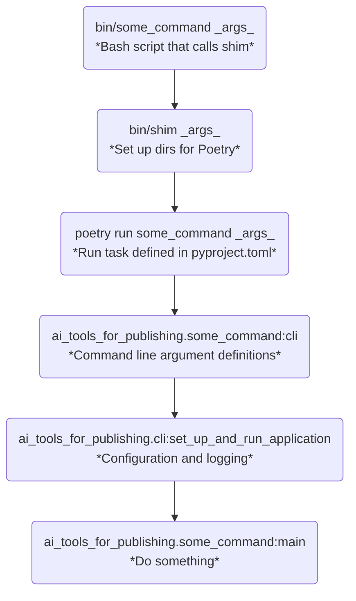

# Call Structure

```mermaid
---
config:
    flowchart:
        wrappingWidth: 1000
---
flowchart
    1(
        bin/some_command _args_
        *Bash script that calls shim*
    )-->
    2(
        bin/shim _args_
        *Set up dirs for Poetry*
    )-->
    3(
        poetry run some_command _args_
        *Run task defined in pyproject.toml*
    )-->
    4(
        ai_tools_for_publishing.some_command:cli
        *Command line argument definitions*
    )-->
    5(
        ai_tools_for_publishing.cli:set_up_and_run_application
        *Configuration and logging*
    )-->
    6(
        ai_tools_for_publishing.some_command:main
        *Do something*
    )
```
