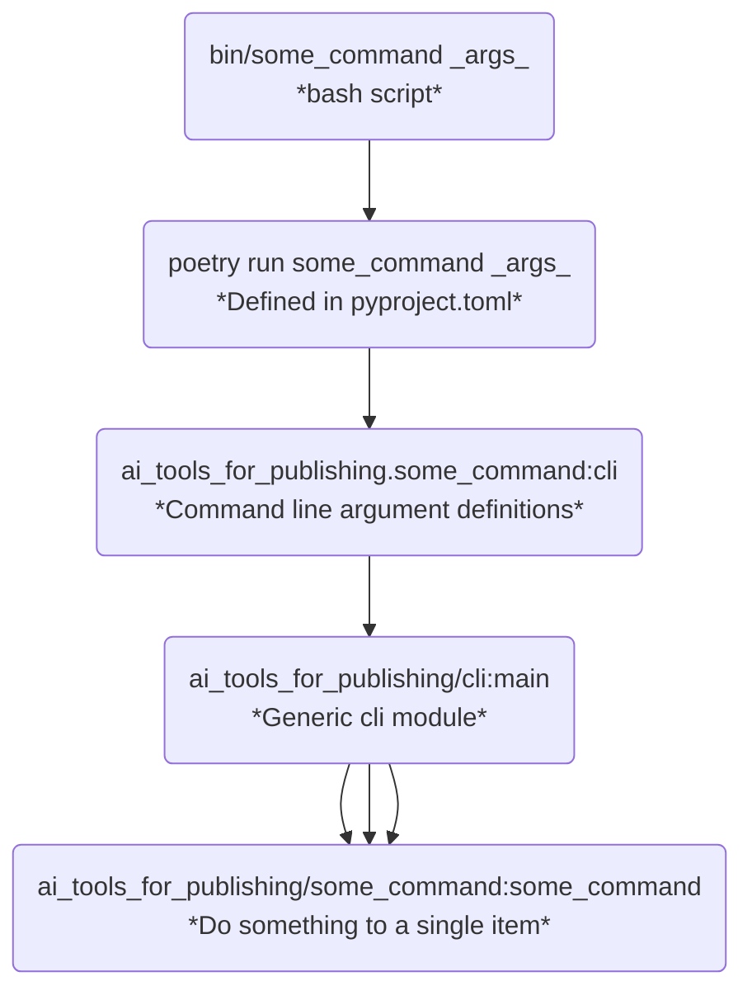

# Plan for Structure

```mermaid
---
config:
    flowchart:
        wrappingWidth: 1000
---
flowchart
    1(
        bin/some_command _args_
        *bash script*
    )-->
    2(
        poetry run some_command _args_
        *Defined in pyproject.toml*
    )-->
    3(
        ai_tools_for_publishing.some_command:cli
        *Command line argument definitions*
    )-->
    4(
        ai_tools_for_publishing/cli:main
        *Generic cli module*
    )-->
    5(
        ai_tools_for_publishing/some_command:some_command
        *Do something to a single item*
    )
    4 --> 5
    4 --> 5
```

## Data Structues

Data is transferred between modules in either BeautifulSoup's `Soup` type, or as a single string.
